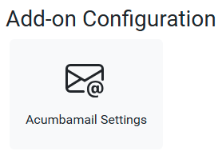
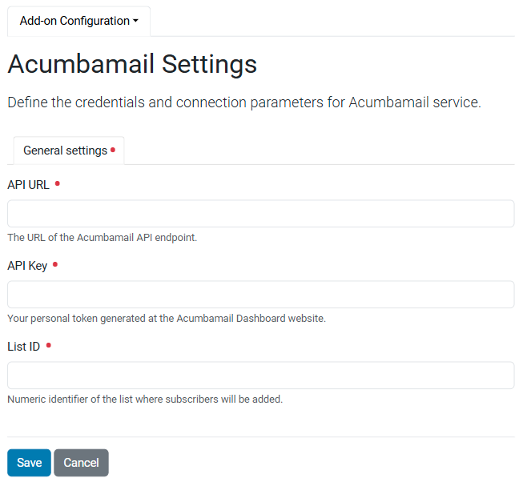

---
myst:
  html_meta:
    "description": "Acumbamail integration with Plone how-to guides"
    "property=og:description": "Acumbamail integration with Plone how-to guides"
    "property=og:title": "Acumbamail integration with Plone how-to guides"
    "keywords": "Acumbamail, service, Plone, integration, documentation, how-to, guides"
---

# How-to guides

This part of the documentation contains how-to guides, including installation and usage.

## Features

- Control panel in Plone registry to manage ``Acumbamail`` settings.

- RestApi endpoint that exposes these settings for Volto.

- Add a [new subscriber](https://acumbamail.com/apidoc/function/addSubscriber/) to the Acumbamail list.

## Volto integration

To use this product in Volto, you needs to include the following add-on in your project: https://github.com/collective/volto-acumbamail

## Translations

This product has been translated into

- Catalan

- English

- Spanish

## Compatibility

- Tested with Python 3.12 and Plone 6.1.5.

## Install it

Install `collective.volto.acumbamail` with `pip`:

```shell
pip install collective.volto.acumbamail
```

## Enable it

Go to the `Site setup`, next to the `Add-ons` control panel, find the `collective.volto.acumbamail` add-on and click on the `Install` button. 

## Use it

To use this add-on, go to the `Site setup`, next to the ``Add-on Configuration`` icon, as shown below:



This `Acumbamail Settings`, you can access the control panel, as shown below:



In this control panel, you can configure the following fields:

- ``API URL``, The URL of the Acumbamail API endpoint.

- ``API Key``, Your Acumbamail personal token generated at the https://acumbamail.com/api/ website.

- ``List ID``, Numeric identifier of the list where subscribers will be added.

## Use it

To use the `Acumbamail` integration you need add the [volto-acumbamail](https://github.com/collective/volto-acumbamail) add-on, in your Volto project and
use the amazain features incluided.
